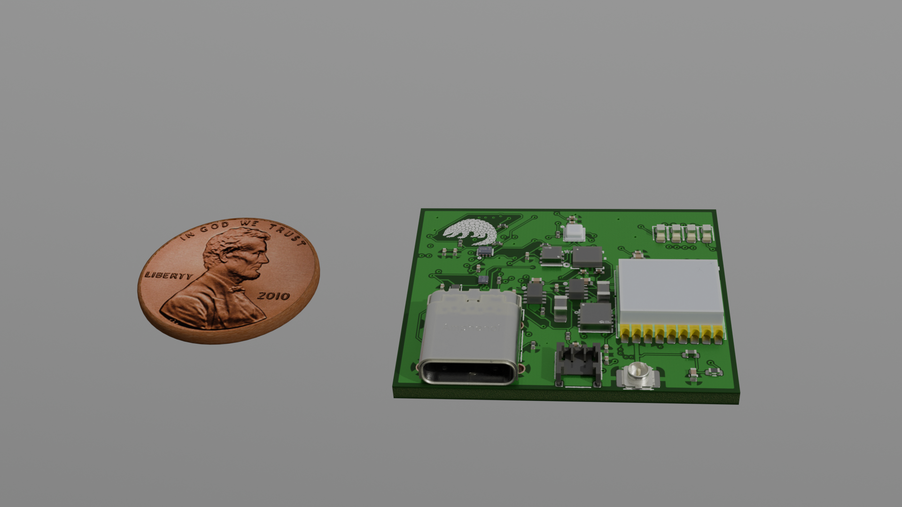

# Pangotag PCB

KiCad 10 project for a GNSS and motion tracking tag for the white-bellied pangolin, built in the
Harvard Microrobotics Laboratory.

## V2

`Pangotag_PCB_LCSC_compat4.kicad_pcb` is the V2 tag: a 31.94 × 27.18 mm, 6-layer, 1.6 mm board with
80 parts on both sides, using parts that JLCPCB stocks.

- STM32U575 microcontroller (LQFP-64) and a 32 GB eMMC on the underside
- u-blox MAX-M10S GNSS module with a U.FL antenna connector
- BMI270 IMU, BMP581 pressure sensor, T117 temperature sensor and LTC2944 coulomb counter on one I2C bus
- Two TPS62840 buck converters for always-on 1.9 V and 3.3 V rails, fed from a 2-pin battery connector
- USB-C for USB and, with a Type-C debug accessory, SWD: two comparators on CC1 and CC2 and an AND
  gate switch a TMUX1511 that puts SWCLK, SWDIO, SWO and NRST on contacts USB 2.0 leaves unused

`Dongle.kicad_pcb` is a 4-layer adapter that connects an ST-Link to the tag's USB-C port in either
orientation, with a reset button.

## Files

| Path | Contents |
| --- | --- |
| `Pangotag_PCB.kicad_sch` and its `Power`, `Communication`, `LEDs` and `st-link_conn` sheets | Schematic |
| `Pangotag_PCB_LCSC_compat4.kicad_pcb` | V2 tag board |
| `Dongle.kicad_pcb` | ST-Link debug dongle |
| `Pangotag_PCB.kicad_pcb` | The tag and an earlier dongle on one sheet |
| `Pangotag_PCB_LCSC_compat*.kicad_pcb`, `Only_Tag*.kicad_pcb` | Intermediate revisions |
| `jlcpcb/` | JLCPCB Gerber, BOM and placement files |
| `export_footprints.pretty/`, `FBGA153.pretty/`, `*.kicad_sym` | Project footprint and symbol libraries |
| `tag_render*.png` | Renders of the board and an enclosure model |
